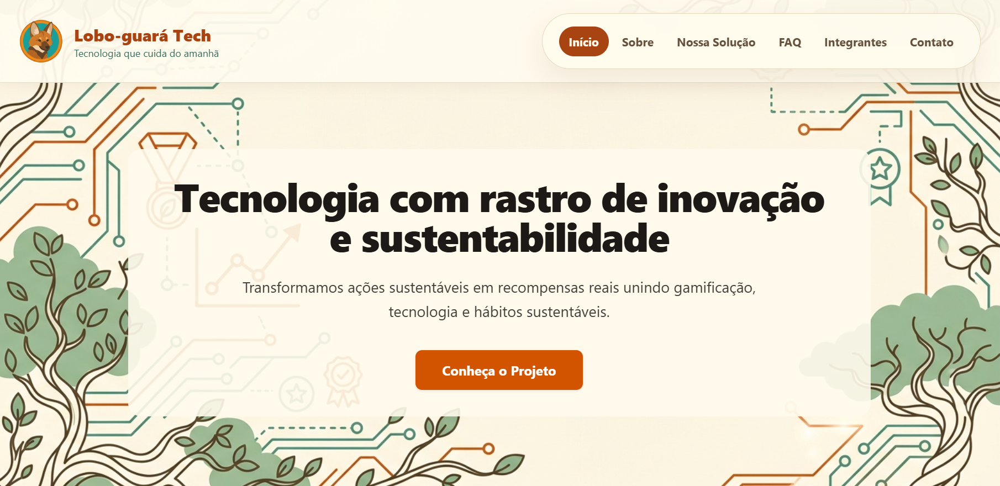
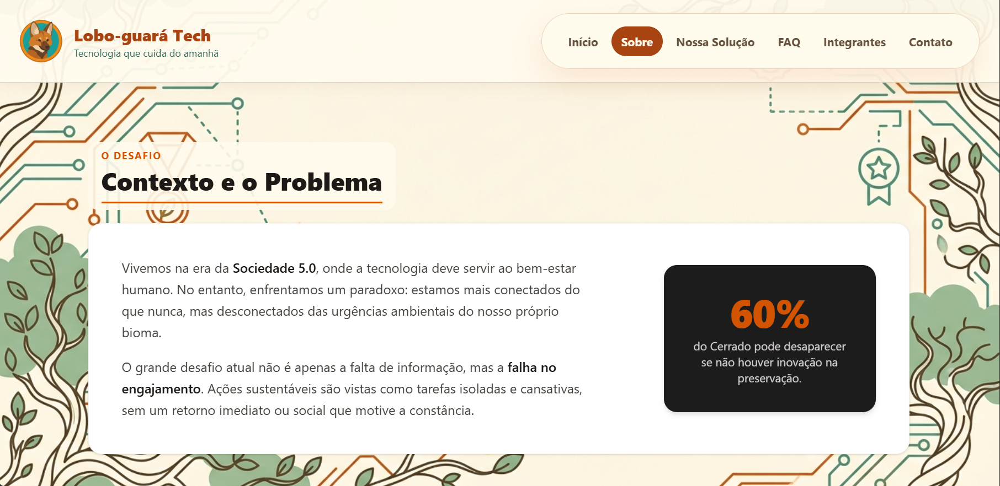
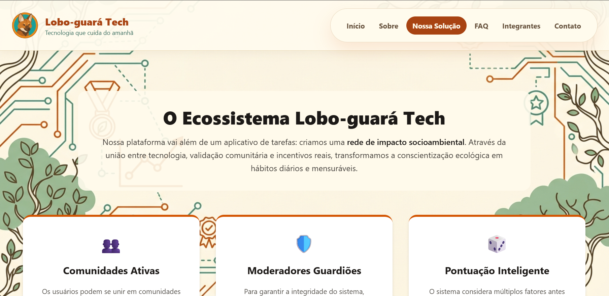
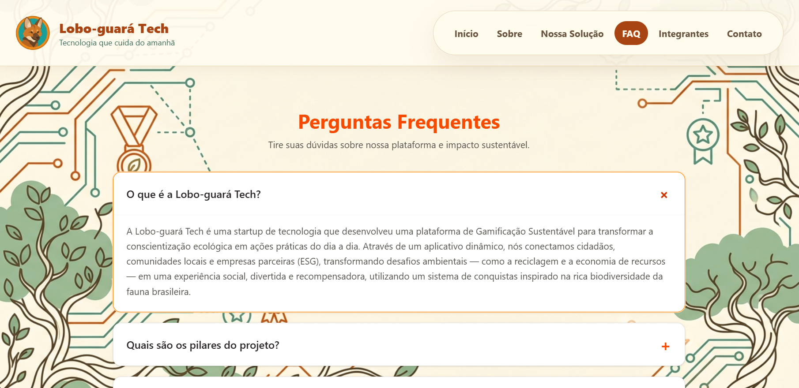
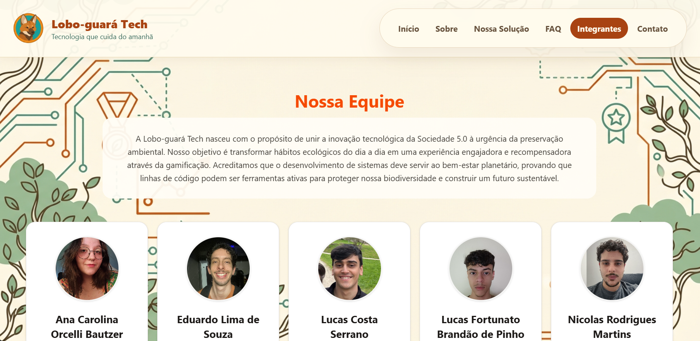
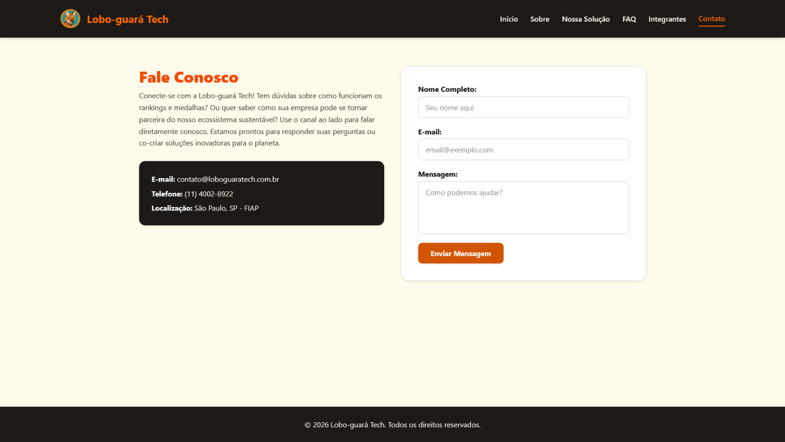

# Lobo-guará Tech | Tecnologia com Rastro de Inovação e Sustentabilidade

## 📄 Descrição do Projeto e Objetivo

O projeto Lobo-guará Tech busca solucionar a dificuldade de engajamento ecológico ao transformar atitudes ecológicas em um ciclo contínuo de motivação. Indo ao encontro da junção entre as inovações incremental e disruptiva, a plataforma conecta mecanismos tecnológicos já existentes às lacunas presentes na sustentabilidade. Criamos, assim, um Sistema de Gamificação Sustentável integrado, desenvolvido para converter o impacto ambiental positivo dos usuários em recompensas tangíveis e reconhecimento por meio de rankings e desafios dinâmicos.

O objetivo deste trabalho é consolidar uma solução que coloque o usuário no centro da resolução de problemas ambientais. A proposta visa tornar a sustentabilidade não apenas uma escolha consciente, mas um hábito diário reforçado por incentivos reais. Dessa forma, a plataforma entrega uma ferramenta capaz de escalar o impacto ecológico de maneira ágil, transformando o compromisso com o planeta em uma experiência digital altamente recompensadora.

## 🛠️ Tecnologias Utilizadas

Para a construção desta aplicação moderna, responsiva e fluida, foram utilizadas as seguintes tecnologias e ferramentas:

* **React:** construção da interface como Single Page Application (SPA), com componentes reutilizáveis, gerenciamento de estado e renderização dinâmica das páginas (Home, Sobre, Solução, FAQ, Integrantes e Contato).
* **TypeScript:** tipagem estática do código, garantindo mais segurança, previsibilidade e facilidade de manutenção durante a evolução do projeto.
* **Vite:** ferramenta de build e servidor de desenvolvimento, responsável pela compilação rápida, hot reload e empacotamento otimizado da aplicação.
* **Tailwind CSS:** classes de estilo usadas nos componentes.
* **CSS3:** estilização global da interface (index.css), fazendo uso de:
    * Classes CSS para as cores, o papel de parede e as animações;
    * Flexbox e Grid Layout para alinhamento dinâmico e organização em cards;
    * Media queries para adaptar o layout a celulares e tablets.
* **JavaScript (via React):** manipulação dinâmica do DOM e gerenciamento de estado para o funcionamento interativo do sistema de **Accordion** na página de FAQ, controlando estados de expansão e animação do conteúdo, e para a página de Contato, na verificação das informações passadas pelo formulário.
* **Git e GitHub:** controle de versionamento, histórico de evolução e publicação do repositório.

## Como executar e verificar

```bash
npm install
npm run dev
```

Para conferir os tipos e gerar a versão final, use `npm run build`. Para verificar as regras de código, use `npm run lint`.

O projeto usa componentes, propriedades, listas com `map`, condições, `useState` e `useEffect`. As rotas ficam no `App.tsx`. O FAQ abre e fecha com o atributo HTML `hidden`, e as animações ficam no `index.css`.

**Contato:** o formulário é uma demonstração com React Hook Form. Ele valida nome, e-mail e mensagem, mas ainda não envia nem salva os dados. O texto preenchido permanece disponível depois da validação.

Para conferir as interações, navegue pelas páginas, abra e feche as perguntas do FAQ, selecione integrantes com mouse e teclado e teste o formulário com campos vazios, espaços e dados válidos. Confira também o layout em celular e desktop.

## 📂 Estrutura de Pastas do Projeto

Abaixo está representada a arquitetura limpa de diretórios do repositório, seguindo o padrão de projetos React + TypeScript com Vite, garantindo organização e fácil manutenção do código-fonte:

```text
front-2.0-main/
├── public/
│   └── favicon.svg              # Ícone da aba do navegador
│
├── src/
│   ├── assets/                  # Acervo de mídias do ecossistema
│   │   ├── github.svg           # Ícone do GitHub
│   │   ├── linkedin.svg         # Ícone do LinkedIn
│   │   ├── Guara.png            # Logotipo oficial Lobo-guará Tech
│   │   ├── papel-fundo.jpg      # Papel de parede
│   │   ├── Pic1.png             # Foto do integrante 1
│   │   ├── Pic2.png             # Foto do integrante 2
│   │   ├── Pic3.png             # Foto do integrante 3
│   │   ├── Pic4.png             # Foto do integrante 4
│   │   ├── Pic5.png             # Foto do integrante 5
│   │   ├── index.png            # Foto da página inicial - Home
│   │   ├── sobre.png            # Foto da página Sobre
│   │   ├── solucao.png          # Foto da página Solução
│   │   ├── faq.png              # Foto da página FAQ
│   │   ├── integrantes.png      # Foto da página integrantes
│   │   └── contato.png          # Foto da página Contato
│   │
│   ├── components/              # Componentes reutilizáveis
│   │   ├── Botao.tsx            # Botão estilizado reutilizável
│   │   ├── CardIntegrante.tsx   # Card de apresentação dos integrantes
│   │   ├── CardMini.tsx         # Card compacto de informações
│   │   ├── CardPilar.tsx        # Card dos pilares do projeto
│   │   ├── FaqItem.tsx          # Item do accordion de perguntas frequentes
│   │   ├── Footer.tsx           # Rodapé da aplicação
│   │   ├── Header.tsx           # Cabeçalho e navegação
│   │   └── TimelineItem.tsx     # Item da linha do tempo (roadmap)
│   │
│   ├── pages/                   # Páginas da aplicação
│   │   ├── Home.tsx             # Página Inicial
│   │   ├── Sobre.tsx            # Página Sobre
│   │   ├── Solucao.tsx          # Página de Solução
│   │   ├── Faq.tsx              # Página de Dúvidas Frequentes
│   │   ├── Integrantes.tsx      # Página dos Integrantes
│   │   └── Contato.tsx          # Página de Contato
│   │
│   ├── types/
│   │   └── types.ts             # Tipos e interfaces TypeScript
│   │
│   ├── App.tsx                  # Componente raiz e organização das rotas
│   ├── main.tsx                 # Ponto de entrada da aplicação React
│   └── index.css                # Estilos globais (variáveis, componentes e responsividade)
│
├── .gitignore                   # Arquivos ignorados pelo Git
├── eslint.config.js             # Configuração do ESLint
├── index.html                   # HTML base carregado pelo Vite
├── package.json                 # Dependências e scripts do projeto
├── package-lock.json            # Trava de versões das dependências
├── tsconfig.json                # Configuração base do TypeScript
├── tsconfig.app.json            # Configuração do TypeScript (aplicação)
├── tsconfig.node.json           # Configuração do TypeScript (Node/Vite)
├── vite.config.ts               # Configuração do Vite
│
└── README.md                    # Guia técnico e informativo (este arquivo)
```

## 👥 Autores e Créditos

O desenvolvimento deste projeto foi idealizado e executado pela equipe de estudantes de **Análise e Desenvolvimento de Sistemas (ADS)** da **FIAP** na **Turma 1TDSPI**:

* **Ana Carolina Orcelli Bautzer** — RM 570281
  *Turma: 1TDSPI* 👉 [LinkedIn](https://www.linkedin.com/in/ana-bautzer/) | 👉 [GitHub](https://github.com/anabautzer)

* **Eduardo Lima de Souza** — RM 570412
  *Turma: 1TDSPI* 👉 [LinkedIn](https://www.linkedin.com/in/duduutech/) | 👉 [GitHub](https://github.com/duduutech)

* **Lucas Costa Serrano** — RM 571016
  *Turma: 1TDSPI* 👉 [LinkedIn](https://www.linkedin.com/in/lucas-costa-serrano-647327278/) | 👉 [GitHub](https://github.com/luckz4)

* **Lucas Fortunato Brandão de Pinho** — RM 572860
  *Turma: 1TDSPI* 👉 [LinkedIn](https://www.linkedin.com/in/lucas-fortunato-317643397/) | 👉 [GitHub](https://github.com/Loutcoun)

* **Nicolas Rodrigues Martins** — RM 573178
  *Turma: 1TDSPW* 👉 [LinkedIn](https://www.linkedin.com/in/nicolas-rodrigues-martins-126607360/) | 👉 [GitHub](https://github.com/NickRM22)

## 📸 Imagens e Representação do Projeto

Abaixo estão as representações visuais das telas que compõem a plataforma, demonstrando a consistência do design, o uso estratégico da paleta de cores institucional e a aplicação de técnicas avançadas de responsividade. As imagens estão localizadas na pasta `src/assets`.

### 💻 1. Interface Desktop (Página Inicial - Home)

*Legenda: Seção principal projetada com contraste refinado, tipografia focada na legibilidade e foco na conversão imediata do usuário para conhecer o projeto.*

### 📄 2. Página Institucional (Sobre)

*Legenda: Apresentação do contexto e problema, os tipos de solução e um roadmap de desenvolvimento.*

### 🚀 3. Detalhamento da Funcionalidade (Solução)

*Legenda: Explicação detalhada do ecossistema de gamificação, regras e a dinâmica de pontuação.*

### 📱 4. Componente de FAQ Expandido (FAQ)

*Legenda: Menu do tipo Accordion tratando quebras de linhas de forma fluida por meio de componentes React e manipulação dinâmica do estado.*

### 👥 5. Página do Time (Integrantes)

*Legenda: Grid responsivo exibindo os cartões dos desenvolvedores com fotos customizadas e links integrados para redes profissionais.*

### ✉️ 6. Canal de Atendimento e Feedback (Contato)

*Legenda: Formulário de demonstração com validação de campos, ainda sem envio de mensagens.*

## 🔗 Link do Repositório e Vídeo

O código-fonte completo, histórico de evoluções e versionamento estruturado deste ecossistema web podem ser acessados publicamente no GitHub através do link oficial e para visualização da página e explicação, o link para o YouTube:

🚀 **[Acesse o Repositório Oficial no GitHub](https://github.com/Challenger-2026/front-2.0)**

📹 **[Acesse o link para vídeo no YouTube](https://youtu.be/OwPp8j7qkXU)**

## 📞 Contato e Suporte

Para esclarecimento de dúvidas técnicas sobre as mecânicas de gamificação, feedbacks sobre a arquitetura responsiva ou propostas de parcerias institucionais ESG, entre em contato através dos canais:

* **E-mail de Suporte:** contato@loboguaratech.com.br
